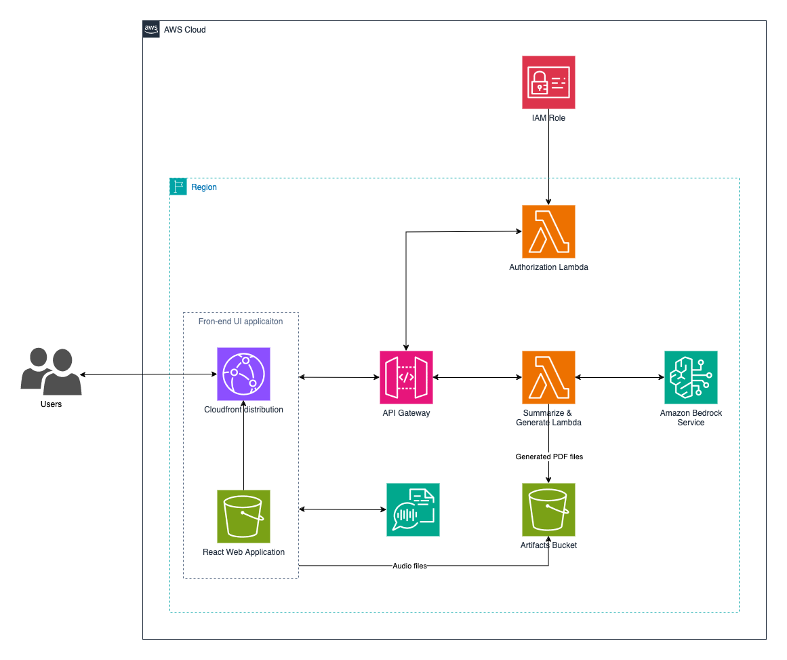

# Knowledge Capture using Live Transcribe and Generative AI

A real-time voice transcription and document generation solution powered by AWS services and Anthropic Claude models on Amazon Bedrock. Users speak into the browser, the audio is transcribed live, and the text is summarized into a professional PDF document using generative AI.

## Features

- **Real-Time Voice Transcription** — Browser-based audio capture streamed to Amazon Transcribe for live speech-to-text conversion. Users can review and edit transcriptions before submission.
- **AI-Powered Summarization** — Transcribed text is summarized into professional documents using Claude 4.5/4.6 models on Amazon Bedrock via LangChain.
- **PDF Document Generation** — Summaries are rendered as styled PDF documents using WeasyPrint and uploaded to S3 with pre-signed download URLs.
- **Audio Recording Storage** — Original audio recordings are saved alongside generated documents in S3.

## Architecture



1. User interacts with the React UI hosted on CloudFront
2. API Gateway routes requests with API key authentication and WAF protection
3. Get-Credentials Lambda returns temporary STS credentials for Amazon Transcribe
4. Amazon Transcribe Live converts speech to text in real-time via WebSocket
5. Orchestration Lambda (Docker-based) summarizes text via Bedrock and generates PDF
6. Generated documents and audio files are stored in S3 with pre-signed URLs returned to the UI

## Technology Stack

| Layer | Technology |
|-------|-----------|
| Infrastructure | AWS CDK 2.240.0 (TypeScript), cdk-nag |
| Frontend | React 18.3, Vite 6.4, Cloudscape Design Components, TypeScript 5.7 |
| API | Amazon API Gateway (REST), WAF, API Key auth |
| Compute | AWS Lambda (Python 3.13), Docker container image |
| AI/ML | Amazon Bedrock (Claude Sonnet 4.6, Claude Haiku 4.5), LangChain 1.2 |
| Storage | Amazon S3 (SSE encryption) |
| Transcription | Amazon Transcribe Live (streaming WebSocket) |
| Hosting | Amazon CloudFront (OAC, WAF, geo-restriction) |
| Build | AWS CodeBuild (React app build triggered via EventBridge) |
| Security | AWS KMS, IAM least-privilege, WAF, OAC, enforceSSL |

## Project Structure

```
├── bin/                          # CDK app entry point
│   └── cdk-react-app.ts
├── lib/
│   ├── cdk-react-app-stack.ts    # Main CDK stack
│   ├── constructs/               # CDK constructs
│   │   ├── api-gateway.ts        # API Gateway + WAF + API key
│   │   ├── lambda.ts             # Lambda functions (get-credentials + orchestration)
│   │   ├── react-app-build.ts    # CodeBuild project for React app
│   │   ├── react-app-deploy.ts   # CloudFront distribution + OAC
│   │   └── s3.ts                 # S3 buckets (documents + React app)
│   ├── lambda-functions/
│   │   ├── get_credentials/      # STS credential vending Lambda
│   │   └── orchestration/        # Summarization + PDF generation Lambda (Docker)
│   └── react-app/                # React frontend application
├── test/                         # CDK tests
├── cdk.json                      # CDK configuration
├── tsconfig.json                 # TypeScript configuration
└── package.json                  # Node.js dependencies
```

## Prerequisites

- **Docker** — Required for building the orchestration Lambda container image
- **Node.js 20+** and npm
- **Python 3.13+**
- **AWS CDK CLI** — `npm install -g aws-cdk`
- **AWS Account** bootstrapped with CDK (`cdk bootstrap`) in us-east-1 or us-west-2
- **Amazon Bedrock Model Access** — Enable Claude Sonnet 4.6 and Claude Haiku 4.5 in the Bedrock console
- **IAM Permissions** — Access to Amazon Transcribe, Amazon Bedrock, Amazon S3, AWS Lambda, CloudFront, API Gateway, CodeBuild, KMS, SSM

## Deployment

### 1. Create and activate a virtual environment

```bash
python3 -m venv .venv
source .venv/bin/activate    # macOS/Linux
# .venv\Scripts\activate.bat  # Windows
```

### 2. Install dependencies

```bash
npm install
```

### 3. Deploy the stack

```bash
cdk deploy
```

The first deployment takes approximately 30–45 minutes to build the Docker image. Subsequent deployments take 5–8 minutes.

After deployment, the CLI outputs:
- **ReactAppUrl** — CloudFront URL for the web application
- **ApiUrl** — API Gateway endpoint
- **ApiKeyParameterName** — SSM Parameter Store key for the API key
- **DocumentsS3Bucket** — S3 bucket for generated documents

### 4. React app build

The React app is automatically built by CodeBuild after stack deployment via an EventBridge rule. The built artifacts are served from S3 through CloudFront.

### Cleanup

```bash
cdk destroy
```

You may also need to manually delete the S3 buckets created by the stack (they contain objects that prevent automatic deletion).

## CDK Commands

| Command | Description |
|---------|-------------|
| `cdk ls` | List all stacks |
| `cdk synth` | Synthesize CloudFormation template |
| `cdk deploy` | Deploy stack to AWS |
| `cdk diff` | Compare deployed stack with local changes |
| `cdk destroy` | Delete the stack |
| `npm run build` | Compile TypeScript |
| `npm test` | Run CDK tests |

## AI Models

The solution uses Amazon Bedrock cross-region inference profiles:

| Model | Inference Profile ID | Use Case |
|-------|---------------------|----------|
| Claude Haiku 4.5 | `us.anthropic.claude-haiku-4-5-20251001-v1:0` | Fast summarization (default for document generation) |
| Claude Sonnet 4.6 | `us.anthropic.claude-sonnet-4-6` | High-quality summarization |
| Claude Opus 4.6 | `us.anthropic.claude-opus-4-6-v1` | Complex analysis (available, not used by default) |

These models require cross-region inference profiles (not direct model IDs) as they don't support single-region on-demand invocation.

## Security

- CloudFront with Origin Access Control (OAC) and WAF
- API Gateway with API key authentication and usage plans
- S3 buckets with enforceSSL, block public access, and server-side encryption
- IAM roles with least-privilege policies
- KMS customer-managed key for encryption
- Geo-restriction (US, CA) on CloudFront distribution
- cdk-nag AwsSolutions checks enabled

## Authors

- Jundong Qiao (jdqiao@amazon.com)
- Praveen Kumar Jeyarajan (pjeyaraj@amazon.com)
- Michael Massey (mmssym@amazon.com)

## License

This project is licensed under the MIT-0 License. See the [LICENSE](LICENSE) file.
