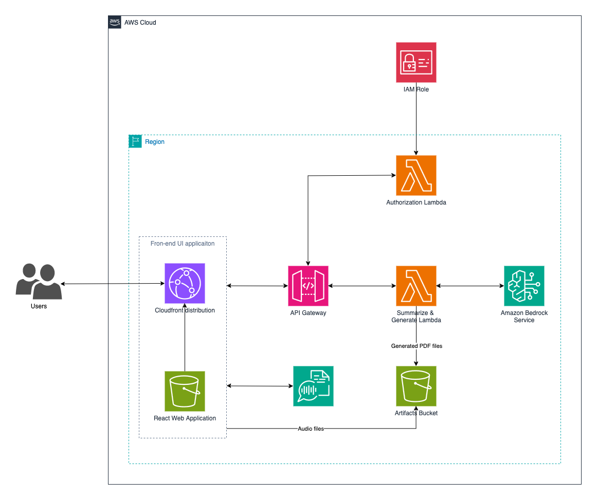

# Knowledge Capture using Live Transcribe and Generative AI

A real-time voice transcription and document generation solution powered by AWS services and Anthropic Claude models on Amazon Bedrock. Users speak into the browser, the audio is transcribed live, and the text is summarized into a professional PDF document using generative AI.

## Features

- **Real-Time Voice Transcription** — Browser-based audio capture streamed to Amazon Transcribe for live speech-to-text conversion. Users can review and edit transcriptions before submission.
- **AI-Powered Summarization** — Transcribed text is summarized into professional documents using Claude 4.5/4.6 models on Amazon Bedrock via LangChain.
- **PDF Document Generation** — Summaries are rendered as styled PDF documents using WeasyPrint and uploaded to S3 with pre-signed download URLs.
- **Audio Recording Storage** — Original audio recordings are saved alongside generated documents in S3.

## Architecture



1. User interacts with the React UI hosted on CloudFront
2. API Gateway routes requests with API key authentication and WAF protection
3. Get-Credentials Lambda returns temporary STS credentials for Amazon Transcribe
4. Amazon Transcribe Live converts speech to text in real-time via WebSocket
5. Orchestration Lambda (Docker-based, ARM64) summarizes text via Bedrock and generates the PDF
6. Generated documents and audio files are stored in S3 with pre-signed URLs returned to the UI

A custom resource sends a warmup invocation to the orchestration Lambda at the end
of every deployment, so the container image layer fetch does not land on the first
user request. See [orchestration/README.md](lib/lambda-functions/orchestration/README.md#cold-start).

## Technology Stack

| Layer | Technology |
|-------|-----------|
| Infrastructure | AWS CDK 2.264.0 (TypeScript), cdk-nag |
| Frontend | React 18.3, Vite 8.2 (rolldown), Cloudscape Design Components, TypeScript 5.9 |
| API | Amazon API Gateway (REST), WAF, API Key auth |
| Compute | AWS Lambda (Python 3.13), Docker container image |
| AI/ML | Amazon Bedrock (Claude Sonnet 4.6, Claude Haiku 4.5), LangChain (core + AWS) 1.x |
| Storage | Amazon S3 (SSE encryption) |
| Transcription | Amazon Transcribe Live (streaming WebSocket) |
| Hosting | Amazon CloudFront (OAC, WAF, geo-restriction) |
| Build | AWS CodeBuild (`standard:7.0`, Node.js 22) triggered via EventBridge |
| Security | AWS KMS, IAM least-privilege, WAF, OAC, enforceSSL |

## Project Structure

```
├── bin/                          # CDK app entry point
│   └── cdk-react-app.ts
├── lib/
│   ├── cdk-react-app-stack.ts    # Main CDK stack
│   ├── constructs/               # CDK constructs
│   │   ├── api-gateway.ts        # API Gateway + WAF + API key
│   │   ├── lambda.ts             # Lambda functions (get-credentials + orchestration)
│   │   ├── react-app-build.ts    # CodeBuild project for React app
│   │   ├── react-app-deploy.ts   # CloudFront distribution + OAC
│   │   └── s3.ts                 # S3 buckets (documents + React app)
│   ├── lambda-functions/
│   │   ├── get_credentials/      # STS credential vending Lambda
│   │   └── orchestration/        # Summarization + PDF generation Lambda (Docker)
│   └── react-app/                # React frontend application
├── test/                         # CDK tests
├── cdk.json                      # CDK configuration
├── tsconfig.json                 # TypeScript configuration
└── package.json                  # Node.js dependencies
```

## Prerequisites

- **Docker** — Required for building the orchestration Lambda container image
- **Node.js 20.19+ or 22.12+** and npm (required by Vite 8)
- **AWS CDK CLI** — `npm install -g aws-cdk`
- **AWS Account** bootstrapped with CDK (`cdk bootstrap`) in us-east-1 or us-west-2
- **Amazon Bedrock Model Access** — Enable Claude Sonnet 4.6 and Claude Haiku 4.5 in the Bedrock console
- **IAM Permissions** — Access to Amazon Transcribe, Amazon Bedrock, Amazon S3, AWS Lambda, CloudFront, API Gateway, CodeBuild, KMS, SSM

A local Python installation is not required. The orchestration Lambda's Python
dependencies are installed inside its container image at build time, and the
get-credentials Lambda uses only the AWS-provided `boto3`.

## Deployment

### 1. Install dependencies

```bash
npm install
```

### 2. Deploy the stack

```bash
cdk deploy
```

The initial deployment takes about 6–7 minutes, most of which is building and
pushing the orchestration Lambda's container image. Incremental deployments take
20–70 seconds, and are faster still when the container image is unchanged.

After deployment, the CLI outputs:
- **ReactAppUrl** — CloudFront URL for the web application
- **ApiUrl** — API Gateway endpoint
- **ApiKeyParameterName** — SSM Parameter Store key for the API key
- **DocumentsS3Bucket** — S3 bucket for generated documents

### 3. React app build

The React app is automatically built by CodeBuild after stack deployment via an
EventBridge rule that fires on stack `CREATE_COMPLETE` and `UPDATE_COMPLETE`. The
build runs on the `standard:7.0` image with the Node.js 22 runtime and writes its
output to the `dist/` prefix of the React app bucket, which CloudFront serves.

## Testing the deployment

The API requires an API key, which the stack stores in Parameter Store. Retrieve it
and call the two endpoints directly:

```bash
API_URL=$(aws cloudformation describe-stacks --stack-name CdkReactAppStack \
  --query "Stacks[0].Outputs[?OutputKey=='ApiUrl'].OutputValue" --output text)
API_KEY=$(aws ssm get-parameter --name transcribe-api-key \
  --query Parameter.Value --output text)

# Temporary STS credentials used by the browser for Amazon Transcribe
curl -s -H "x-api-key: $API_KEY" "${API_URL}get-credentials"

# Summarize text and generate a PDF; returns pre-signed URLs
curl -s -X POST "${API_URL}orchestration" \
  -H "x-api-key: $API_KEY" -H "Content-Type: application/json" \
  -d '{"documentName":"smoke-test",
       "questionText":"What is Amazon SageMaker?",
       "documentText":"Amazon SageMaker is a fully managed machine learning service.",
       "audioFiles":[]}'
```

Requests without a valid API key return `403`. API Gateway error responses carry
CORS headers, so a browser client can read the status instead of seeing an opaque
network error; a `504` means the request exceeded API Gateway's 29 second
integration timeout.

Expected latency for the orchestration endpoint is roughly 4 seconds warm and 5–8
seconds on a cold container.

## Cleanup

```bash
cdk destroy
```

Both S3 buckets are created with `RemovalPolicy.DESTROY` and `autoDeleteObjects`, so
their contents are removed as part of the teardown. If CloudFront writes access logs
into the React app bucket while the stack is being deleted, that bucket can be left
behind and needs to be emptied and deleted manually.

## CDK Commands

| Command | Description |
|---------|-------------|
| `cdk ls` | List all stacks |
| `cdk synth` | Synthesize CloudFormation template |
| `cdk deploy` | Deploy stack to AWS |
| `cdk diff` | Compare deployed stack with local changes |
| `cdk destroy` | Delete the stack |
| `npm run build` | Compile TypeScript |
| `npm test` | Run CDK tests |

## AI Models

The solution uses Amazon Bedrock cross-region inference profiles:

| Model | Inference Profile ID | Use Case |
|-------|---------------------|----------|
| Claude Haiku 4.5 | `us.anthropic.claude-haiku-4-5-20251001-v1:0` | Fast summarization (default for document generation) |
| Claude Sonnet 4.6 | `us.anthropic.claude-sonnet-4-6` | High-quality summarization |
| Claude Opus 4.6 | `us.anthropic.claude-opus-4-6-v1` | Complex analysis (available, not used by default) |

These models require cross-region inference profiles (not direct model IDs) as they don't support single-region on-demand invocation.

## Security

- CloudFront with Origin Access Control (OAC) and WAF
- API Gateway with API key authentication and usage plans
- S3 buckets with enforceSSL, block public access, and server-side encryption
- IAM roles with least-privilege policies
- KMS customer-managed key for encryption
- Geo-restriction (US, CA) on CloudFront distribution
- cdk-nag AwsSolutions checks enabled

### Known dependency findings

`brace-expansion` 5.0.8 is reported by Dependabot under
[GHSA-rgw5-rvv9-x895](https://github.com/advisories/GHSA-rgw5-rvv9-x895) (high, DoS via
unbounded intermediate arrays). It cannot currently be remediated from this repository:
the only vulnerable copy is `node_modules/aws-cdk-lib/node_modules/brace-expansion`,
reached through aws-cdk-lib's own bundled `minimatch`. Because that copy is marked
`inBundle` — shipped inside the aws-cdk-lib tarball — neither `npm audit fix` nor an
`overrides` entry replaces it, and aws-cdk-lib is already pinned to the latest release
(2.264.0). It clears when aws-cdk-lib ships a release bundling 5.0.9 or later.

The accepted risk is low: aws-cdk-lib is a build-time dependency of the CDK app only.
It is absent from `lib/react-app/package.json` and from the orchestration Lambda's
`requirements.txt`, so this code path runs during `cdk synth`/`cdk deploy` over
developer-authored glob patterns and never reaches the CloudFront-served bundle or the
Lambda container. Re-check on each aws-cdk-lib upgrade.

## Authors

- Jundong Qiao (jdqiao@amazon.com)
- Praveen Kumar Jeyarajan (pjeyaraj@amazon.com)
- Michael Massey (mmssym@amazon.com)

## License

This project is licensed under the MIT-0 License. See the [LICENSE](LICENSE) file.
