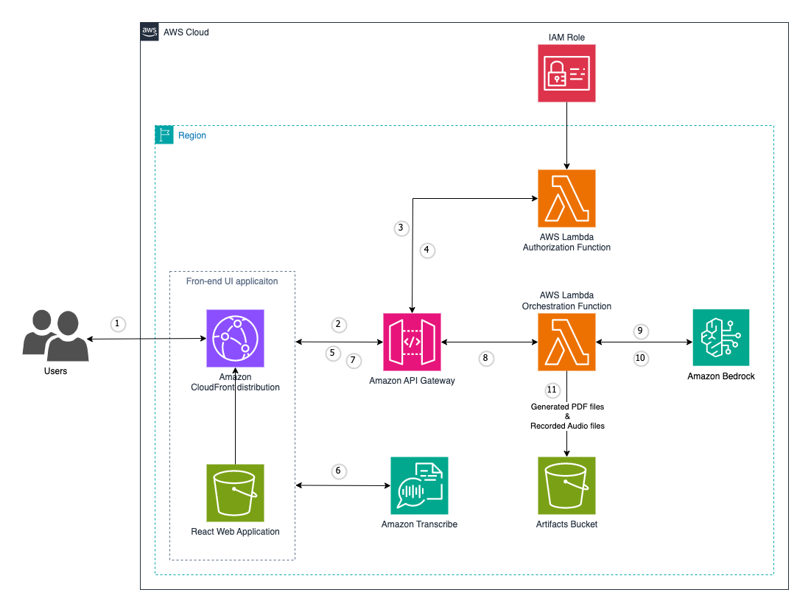

# Knowledge Capture using Live Transcribe and GenerativeAI

Welcome to the Knowledge Capture Solution using Live Transcribe and GenerativeAI! This project provides a comprehensive system for real-time voice transcription, text analysis, anomaly detection, and professional document summarization. Below is an overview of the main features and functionalities of the solution:

## Features

### 1. Real-Time Voice Transcription

Our solution offers real-time voice transcription that allows users to review and edit transcriptions to ensure accuracy. The system ensures that user inputs pertain to a single topic, enhancing the quality and relevance of the transcriptions.

- **Real-Time Transcription:** Transcribe voice inputs in real-time.
- **User Review and Edit:** Users can review and edit the transcriptions to ensure accuracy.
- **Single Topic Focus:** User inputs are expected to focus on a single topic to maintain coherence.

### 2. Professional Document Summarization

Once the transcribed texts are edited and confirmed to be on the same topic, the solution summarizes the set of texts into a professional document ready for review.

- **Text Summarization:** Summarize edited and validated transcriptions into a coherent document.
- **Professional Quality:** Ensure the document is professionally formatted and ready for review.

## Getting Started

To get started with this project, clone the repository and follow the installation instructions in the README file. The solution is designed to be user-friendly and integrates seamlessly with your existing workflows.

We hope this project helps streamline your voice transcription and document creation processes, ensuring accuracy and efficiency every step of the way.

## Table of Contents

- [Knowledge Capture using Live Transcribe and GenerativeAI](#knowledge-capture-using-live-transcribe-and-generativeai)
  - [Features](#features)
    - [1. Real-Time Voice Transcription](#1-real-time-voice-transcription)
    - [2. Professional Document Summarization](#2-professional-document-summarization)
  - [Getting Started](#getting-started)
  - [Table of Contents](#table-of-contents)
  - [Prerequisites](#prerequisites)
  - [Target technology stack](#target-technology-stack)
  - [Solution Overview](#solution-overview)
  - [Solution Architecture](#solution-architecture)
  - [Deployment](#deployment)
  - [Useful CDK commands](#useful-cdk-commands)
  - [Authors and acknowledgment](#authors-and-acknowledgment)

## Prerequisites

- Docker
- AWS CDK Toolkit 2.114.1+, installed installed and configured. For more information, see Getting started with the AWS CDK in the AWS CDK documentation.
- Python 3.12+, installed and configured. For more information, see Beginners Guide/Download in the Python documentation.
- An active AWS account
- An AWS account bootstrapped by using AWS CDK in us-east-1 or us-west-2. Enable Claude model access in Bedrock service.
- An AWS IAM user/role with access to Amazon Transcribe, Amazon Bedrock, Amazon S3, and Amazon Lambda

## Target technology stack

- Amazon Bedrock
- Amazon Lambda
- Amazon S3
- Amazon Transcribe Live
- Amazon CloudFront
- Amazon API Gateway
- AWS ColdBuild
- AWS CDK
- AWS EventBridge
- AWS IAM
- AWS Key Management Service
- AWS Parameter Store
- React

## Solution Overview

## Solution Architecture



This diagram outlines a workflow for a voice-based application using AWS services. Here’s a step-by-step description of the workflow:

1. **User Interaction**:

   - A user interacts with the system through a UI on a device. This UI has a voice input feature.

2. **API Gateway**:

   - The voice input from the user is sent to the API Gateway. The API Gateway acts as an entry point for all the API calls, handling request routing, authorization, and throttling.

3. **Authorization Lambda Function**:

   - The API Gateway triggers an AWS Lambda function for authorization. This function verifies if the user has the necessary permissions to access the services.

4. **Amazon Transcribe Live**:

   - Once authorized, the voice input is processed by Amazon Transcribe Live, which converts the speech to text in real-time.

5. **Summarize & Generate Lambda Function**:

   - The transcribed text is then sent to another AWS Lambda function responsible for summarizing and generating content. This could involve processing the text for various purposes, such as creating summaries, generating responses, or performing further analysis.

6. **Amazon S3 Bucket**:

   - Any generated content, summaries, or processed data are stored in an Amazon S3 bucket. This allows for scalable and durable storage of the processed information.

7. **Return to UI**:
   - Finally, the processed information or responses are sent back to the user’s device through the API Gateway, completing the workflow cycle.

## Deployment

The `cdk.json` file tells the CDK Toolkit how to execute your app.

This project is set up like a standard Python project. The initialization
process also creates a virtualenv within this project, stored under the `.venv`
directory. To create the virtualenv it assumes that there is a `python3`
(or `python` for Windows) executable in your path with access to the `venv`
package. If for any reason the automatic creation of the virtualenv fails,
you can create the virtualenv manually.

To manually create a virtualenv on MacOS and Linux:

```bash
$ python3 -m venv .venv
```

After the init process completes and the virtualenv is created, you can use the following
step to activate your virtualenv.

```bash
$ source .venv/bin/activate
```

If you are a Windows platform, you would activate the virtualenv like this:

```powershell
% .venv\Scripts\activate.bat
```

Once the virtualenv is activated, you can install the required dependencies.

```bash
$ pip install -r requirements.txt
```

To add additional dependencies, for example other CDK libraries, just add
them to your `setup.py` file and rerun the `pip install -r requirements.txt`
command.

At this point you can now synthesize the CloudFormation template for this code.

```bash
$ cdk synth
```

To add additional dependencies, for example other CDK libraries, just add
them to your `setup.py` file and rerun the `pip install -r requirements.txt`
command.

You will need to bootstrap it if this is your first time running cdk at a particular account and region.

```
$ cdk bootstrap
```

Once it's bootstrapped, you can proceed to deploy cdk.

```
$ cdk deploy
```

If this is your first time deploying it, the process may take approximately 30-45 minutes to build several Docker images in ECS (Amazon Elastic Container Service). Please be patient until it's completed. Afterward, it will start deploying the docgen-stack, which typically takes about 5-8 minutes.

Once the deployment process is complete, you will see the output of the cdk in the terminal, and you can also verify the status in your CloudFormation console.

To delete the cdk once you have finished using it to avoid future costs, you can either delete it through the console or execute the following command in the terminal.

```bash
$ cdk destroy
```

You may also need to manually delete the S3 bucket generated by the cdk. Please ensure to delete all the generated resources to avoid incurring costs.

## Useful CDK commands

- `cdk ls` list all stacks in the app
- `cdk synth` emits the synthesized CloudFormation template
- `cdk deploy` deploy this stack to your default AWS account/region
- `cdk diff` compare deployed stack with current state
- `cdk docs` open CDK documentation
- `cdk destroy` dstroys one or more specified stacks

## Authors and acknowledgment

Jundong Qiao (jdqiao@amazon.com)
Praveen Kumar Jeyarajan (pjeyaraj@amazon.com)
Michael Massey (mmssym@amazon.com)
